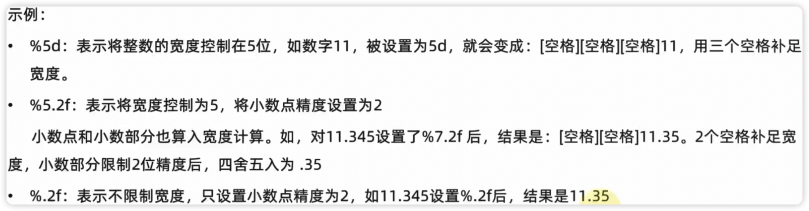
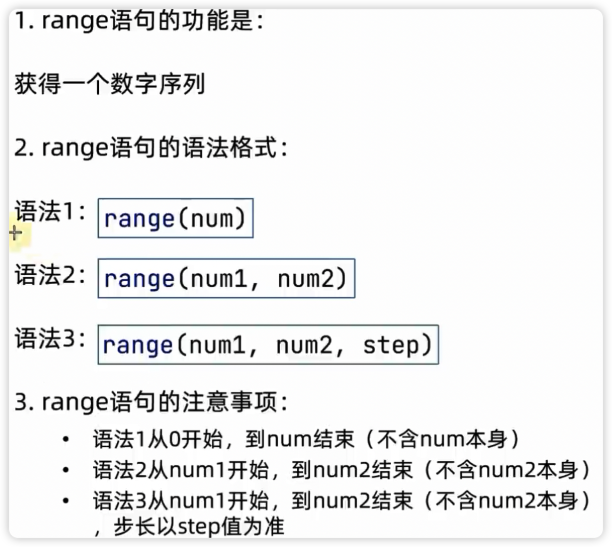

[toc]
# 第一章

## Python常用的值类型


| 类型             | 描述                                                      | 说明                                                                                                                                                                 |
| ---------------- | --------------------------------------------------------- | -------------------------------------------------------------------------------------------------------------------------------------------------------------------- |
| 数字(Number)     | 支持：整数(int)浮点数(float)复数(complex)布尔(bool)<br /> | 整数(int) 如：10，-10<br />浮点数(float)如：13.14,-13.14 <br />复数(complex)如：4+3j,以j结尾表示复数<br />布尔(bool)表达真和假，ture为真,False表示假 True=1 False=0 |
| 字符串(String)   | 描述文本的一种数据类型                                    | 字符串(string) 由任意数量的字符组成                                                                                                                                  |
| 列表(List)       | 有序的可变序列                                            | 可有序记录一堆数据                                                                                                                                                   |
| 元组(Tuple)      | 有序的不可变序列                                          | 可无序记录一堆不重复的Python数据集合                                                                                                                                 |
| 集合(Set)        | 无序不重复集合                                            | 可无序记录一堆不重复的Python数据集合                                                                                                                                 |
| 字典(Dictionary) | 无序Key-Value集合                                         | 可无序记录一堆key-value型的Python数据集合                                                                                                                            |

**字面量：代码中，被写在代码中的固定的值，称为字面量**

## 注释

单行注释：# 我是单行注释

多行注释："""我是多行注释"""

## type()语句

验证数据的类型：

语法：**type(被查看类型的数据)**

type不仅能查看字面量数据的类型，还能查看变量内存储的数据类型

type 查看的是存储的数据的类型。因为，变量无类型，但是它存储的数据有

## 字符串、整数、浮点数类型转换语句

- int(x) : 将x转换为一个整数
- float(x) : 将x转换为一个浮点数
- str(x) : 将对象x 转换为字符串

  **浮点数转整数会丢失精度**

## 标识符

变量名规范：

- 多个单词组合变量名，要使用下划线做分隔
- 变量名中的英文字母，应全部小写

## 算术运算符


| 运算符 | 描述   | 实例                                                    |
| ------ | ------ | ------------------------------------------------------- |
| +      | 加     | 两个对象相加a+b 输出结果30                              |
| -      | 减     | 得到负数或是一个数减去另一个数                          |
| *      | 乘     | 两个数相乘或是返回一个被重复若干次的字符串a*b           |
| /      | 除     | b/a                                                     |
| //     | 取整除 | 返回商的整数部分 9//2 输出结果 4，9.0//2.0 输出结果 4.0 |
| %      | 取余   | 返回除法的余数b%a                                       |
| **     | 指数   | a**b为10的20次方                                        |

## 赋值运算符


| 运算符 | 描述       | 实例                                                            |
| ------ | ---------- | --------------------------------------------------------------- |
| =      | 赋值运算符 | 把 = 号右边的结果 赋给 左边的变量，如 num=1+2*3，结果num的值为7 |

## 复合赋值运算符


| 运算符 | 描述             | 实例               |
| ------ | ---------------- | ------------------ |
| +=     | 加法赋值运算符   | c+=a 等效于c=c+a   |
| -=     | 减法赋值运算符   | c-=a 等效于c=c-a   |
| *=     | 乘法赋值运算符   | c*=a 等效于c=c*a   |
| /=     | 除法赋值运算符   | c/=a 等效于c=c/a   |
| //=    | 取整除赋值运算符 | c//a 等效于c=c//a  |
| %=     | 取模赋值运算符   | c%=a 等效于c=c%a   |
| **=    | 幂赋值运算符     | c**=a 等效于c=c**a |

## 字符串格式化

可以通过如下语法完成字符串和变量的快速拼接

```python
name = "张三"
message = "hello %s" % name
print(message)
```

其中的 %s:

> * % 表示: 我要占位
> * s 表示: 将变量变成字符串放入占位的地方

综合起来就是: 我先占个位置,等一会有个变量过来,我把它变成字符串放到占位的位置

Python 中最常用的三类占位符


| 格式符号 | 转化                            |
| -------- | ------------------------------- |
| %s       | 将内容转化成字符串,放入占位位置 |
| %d       | 将内容转化成整数,放入占位位置   |
| %f       | 将内容转换成浮点型,放入占位位置 |

### 字符串格式化-数字精度控制

> 我们可以使用辅助符号 **“m.n”** 来控制数据的宽度和精度
>
> * m, 控制宽度,要求是数字,设置的宽度小于数字自身,不生效
> * .n,控制小数点精度,要求是数字,会进行小数的四舍五入
>   

### 字符串格式化-快速写法

> f: format
>
> 通过语法: f"内容{变量}" 的格式来快速格式化
>
> **这种方式:**
>
> * 不理会类型
> * 不做精度控制
> * 适合对精度没有要求的时候快速使用

### 字符串格式化-表达式的格式化

表达式: 一条具有明确执行结果的代码语句

# 第二章

## input 语句(函数)

> 用来获取键盘输入
>
> * 数据输出: print
> * 数据输入: input

使用:

* 使用input()语句可以从键盘获取输入
* 使用一个变量接收(存储) input语句获取的键盘输入数据即可
* 无论键盘输入什么类型的数据,获取到的数据永远是**字符串类型**

# 第三章

## 布尔类型的定义
> 布尔类型的字面量
> * True 表示真 (是、肯定)
> * False 表示假 (否、否定)
> 
> 定义变量存储布尔类型数据:
> 变量名称 =  布尔类型字面量

## 比较运算符


## if判断语句
> 程序中的判断
```python
if 1>2: 
       print('条件成立时,要做的事情') 
```
### if-else 组合判断语句
> 语法
```python
if 1>2:
   print("满足条件 do something")
else:
   print("不满足条件 do something")
```

### if-elif-else 语句
> 语法
```python
num = 10
if num>2:
  print("do something")
elif num<11:
  print("满足条件 do something")
elif num==20:
  print("满足条件 do something")
else:
  print("满足条件 do something")
```
## 判断语句的嵌套
> 语法
```python
num = 4
num1 = 2
if num > 0:
  print("do something 2")
  if num < num1:
    print("do something 3")
  else:
    print("......")
else:
  print("end")
```

# 第四章

## while 循环的基础应用
> 语法
```python
count = 1
while count<10 :
  print("do something")
  count+=1
```
只要满足条件,会无限循环

## while 循环嵌套
```python
count = 1
while count<10 :
  print("do something")
  count+=1
  while count < 5 :
    print("do something 2")
```
## 补充-print 输出不换行
```python
print("hello",end='')
print("world",end='')
```
## 补充-制表符\t
> 在字符串中,有一个特殊符号:\t,效果同等于键盘的: tab键

```python
print("hello world")
print("hi nihao")

print("hello\tworld")
print("hi\tnihao")
```

## for循环
> 语法
```python
# 遍历字符串
name = "nihaohahaheihei"
for x in name :
    print(x)
```
### range语句
> 语法1
```python

# range(num)
range(5)
# 获取一个从0开始,到num结束的数字序列(不包含num本身)
# 如range(5)取得的数据是:[0,1,2,3,4]
```
> 语法2
```python
# range(num1,num2)
range(5,10)
# 取得的数据是:[5,6,7,8,9]
```
> 语法3
```python
# range(num1,num2,step)
range(5,10,2)
# 从num1开始到num2结束的数字序列(不包含num2本身)
#数字之间的步长,以step为准(step默认为1)
#如range(5,10,2) 取得的数据是:[5,7,9]
```
range语句总结:


